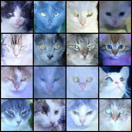

# cat-diffusion-pytorch
A simple PyTorch routine for training a diffusion model (includes ChatGPT-generated code)

----

## Training

The training code is provided in the **`training.ipynb`** file. Open this file in Jupyter Notebook to follow the step-by-step implementation and train the diffusion model.

---

## Samples

Generated images from different timepoints during training are saved in the **`/samples`** directory. Below is a preview of the generated samples:

| **Step 1000**         | **Step 5000**         | **Step 10000**         |
|------------------------|-----------------------|-------------------------|
|  |  |  |

| **Step 20000**         | **Step 30000**         | **Step 40000**         |
|-------------------------|------------------------|-------------------------|
|  |  |  |

| **Step 50000**         | **Step 60000**         | **Step 70000**         |
|-------------------------|------------------------|-------------------------|
|  |  |  |

| **Step 80000**         | **Step 90000**         | **Step 100000**         |
|-------------------------|------------------------|--------------------------|
|  |  |  |
